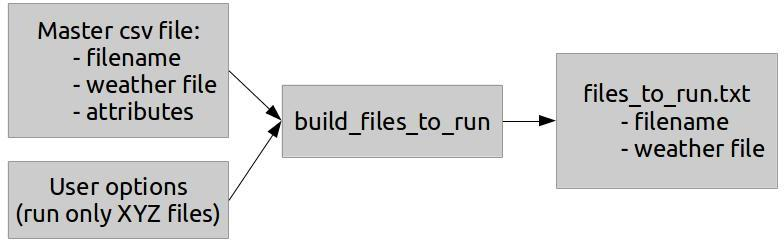

Running from Command Line
=========================

The original design of these scripts was for them to be used from the
command line. It was only later that the graphical interface was added
as a front-end for the scripts. Because of this original design, the
scripts are very easily run from the command line, with the process
described here. There are two core stages to running from the command
line: building the list of files to run, and running them.

Running build\_files\_to\_run.py
--------------------------------

In order to run a test suite, the main suite engine must know what files
are to be run. The build\_files\_to\_run script generates a file to be
used later by the test suite engine, that contains a properly formatted
listing of files to be run. The basic operation is shown in Figure
[fig:cmdprocess].

   High level overview of utilizing the build\_files\_to\_run script to
   generate a list of files for a test suite

Figure [fig:cmdprocess] shows how the process begins by combining the
master csv file which lists all the details about the idf set with a set
of user options such as "Don’t run files with external interface dependence,
and select a random set of 7". The script process these two inputs, and
results in a down-selected list of files. This list of files is then written
out to the file named files\_to\_run.txt to be used by the main test suite engine later.

Calling Signature
~~~~~~~~~~~~~~~~~

The script accepts a number of command line arguments to determine which
files to include in the output file. The usage/help of the script is
provided here verbatim:

::

    $ ./build_files_to_run.py --help
    usage: build_files_to_run.py [-h] [-a] [-e] [-g] [-d] [-l] [-m] [-p] [-r [N]]
                                 [-w] [-u] [-v <path>]

    Create EnergyPlus test file inputs for a specific configuration. Can be
    executed in 2 ways: 1: Arguments can be passed from the command line, such as
    `./build_files_to_run.py -r 3 -w' .. Most useful for scripting, or 2: An
    argument class can be created using the FileListArgsBuilderForGUI class and
    passed into a FileListBuilder instance .. Most useful for UIs

    optional arguments:
      -h, --help            show this help message and exit
      -a, --all             Includes all files found in the master, overrides
                            other flags, can still down select with -r
      -e, --extinterface    Include external interface test files
      -g, --groundht        Include ground heat transfer test files
      -d, --dataset         Include external dataset test files
      -l, --delight         Include DeLight test files
      -m, --macro           Include files with macro definitions
      -p, --parametric      Include parametric preprocessor test files
      -r [N], --random [N]  Get random selection of <N> files
      -w, --weatherless     Include files that do not have a weather file
      -u, --underscore      Include files that start with an underscore
      -v <path>, --verify <path>
                            Performs verification that files exist in a directory.
                            Excludes those that do not. Argument is a path to a
                            test file directory containing idfs and imfs.

Most of the command line arguments are simple flags that don’t require
arguments themselves. By default several idf file types are *excluded*
from the selection because at one point, not everyone built a full
EnergyPlus install-caliber set of binaries.  This is different nowadays,
but this script still excludes some classes of files by default. As such,
using any of the following flags will add the files that match the dependency:

* -d: dataset, dependent on an external dataset file
* -e: external interface, dependent on EnergyPlus built with External Interface
* -g: ground HT, dependent on ground heat transfer preprocessor
* -l: delight, dependent on EnergyPlus built with DeLight
* -m: includes macro definition, dependent on EP-Macro
* -p: parametric, dependent on the parametric preprocessor tools
* -w: weatherless, include files that don’t have a weather file defined in the master csv file
* -u: underscore, include files that begin with an underscore, which are internal test files

In addition to these simple switch flags, there are other flags:

* -a: Include all files in base selection, overrides other switches
* -r <n>: Down select the base selection to <n> files, where <n> is an integer
* -v <path>: Once the base selection is made, use a folder of idfs to prune any idfs that do not exist in that folder

Once the build\_files\_to\_run script is complete, a file named
files\_to\_run.txt will exist in the same directory, and be available
for the runtests script, described next.

Running runtests.py
-------------------

Just like the file list builder script, runtests.py is set up to easily be executed
from the command line.

Calling Signature
~~~~~~~~~~~~~~~~~

The runtests script can be executed from the command line easily. The
usage of the script is available here:

::

    $ ./epregressions/runtests.py --help
    usage: runtests.py [-h] [-a] [-b] [-f {DD,Annual}] [-j J] [-t]
                       a_src a_build b_src b_build idf_list_file

    Run EnergyPlus tests using a specified configuration. Can be executed in 2
    ways: 1: Arguments can be passed from the command line in the usage here, or
    2: An instance of the TestSuiteRunner class can be constructed, more useful
    for UIs or scripting

    positional arguments:
      a_src           Path to case a's source repository root
      a_build         Path to case a's build directory
      b_src           Path to case b's source repository root
      b_build         Path to case b's build directory
      idf_list_file   Path to the file containing the list of IDFs to run

    optional arguments:
      -h, --help      show this help message and exit
      -a              Use this flag to run case a files
      -b              Use this flag to run case b files
      -f {DD,Annual}  Force a specific run type
      -j J            Number of processors to use
      -t              Use this flag to run in test mode

Simply pass in the five positional arguments, usually the ``-a`` and ``-b`` flags
to run those cases, and then possibly the ``-j`` to define the number of
threads to use, and that's it.  Off it goes running tests...

For some deeper information, each section of this setup is described in the following sections.

Setup Build Directories
'''''''''''''''''''''''

The test suite engine must know where to find the executables and where
to run the simulations. A SingleCaseInformation class is instantiated for
each of a base and mod run. It has arguments to a source repo and a
connected build folder for that directory. The run\_this\_directory is set
to True or False to specify whether this directory is actually to be run.
If the runs in that base directory are already done, you don't need to re-run them.

Set Single Test Run Flag
''''''''''''''''''''''''

The suite engine includes a small option to just run the first file
encountered and then exit. This is especially useful for testing that
the directories are set up. The ``DoASingleTestRun`` flag shows how to use this.

Building the File List
''''''''''''''''''''''

Next the built file list is used by the test script to prepare the test suite.
At one time, this logic was embedded within the suite engine, but it was found to be
non-convenient to have this done inside the suite engine. Instead, the
suite engine now accepts a structured file listing, not a filename. The
logic in these lines of code is quite straightforward:

* Open the file containing the selected idfs and weather files
* Loop over each line of the file
* If the line is blank or starts with “!”, ignore this line
* Initialize the basename and epw variables to blank
* Split the line by a space character, into an array called tokens
* Trim anything off the first token and assign it to basename
* If there is a second token, trim it and assign it to epw
* Create a TestEntry instance from this info and add it to the entries array

Build the Full Run Configuration
''''''''''''''''''''''''''''''''

At this point, there is enough information to build a full run
configuration. A number of flags are passed into the ``TestRunConfiguration``
constructor for creating a TestRunConfiguration instance:

run\_mathdiff
    In some cases, running mathdiff may not be necessary or desired, but
    typically this will be True

do\_composite\_err
    In some cases, it may not be necessary or desired to process the
    error files, but typically this will be True

force\_run\_type
    This flag causes the suite engine to force EnergyPlus to run files
    in a specific manner. The options are defined as
    ForceRunType.<type>, where <type> is: NONE, DD, ANNUAL, REVERSEDD

single\_test\_run
    This is where the one-file run flag is passed if desired

num\_threads
    This defines the maximum number of threads to be used in running the
    suite of files.

buildA, buildB
    This is where the SingleBuildDirectory instances are passed in

Creating and Running
''''''''''''''''''''

Once the list of input files is developed and the run configuration is ready, the test
suite can be created by passing these two variables in to the ``TestSuiteRunner``
constructor. The test suite engine then processes this information into an internal data structure.
Once complete, the run\_test\_suite method can be called on this
instance, and the test suite will run. The output files from the test
suite will be placed in the base directory as appropriate.

Scripting Information
---------------------

The previous two sections described running the scripts interactively
from a command line. A level of automation can be added to these scripts
where a test suite can be established by executing a single Python file.
The file should first import the build\_files\_to\_run contents and the
runtests contents. This will import all the class definitions and code,
but not execute anything. The high level script should then construct
arguments much like the executable sections of each underlying script.
In some cases, such as the file builder, an argument builder class is
available. Currently it is directed toward running the file builder as a
backend for a GUI, but it could be modified to be more for a command
line script. Doing this configuration in a single file makes it hard to
run individual pieces, but makes it easy to run an entire suite process.
