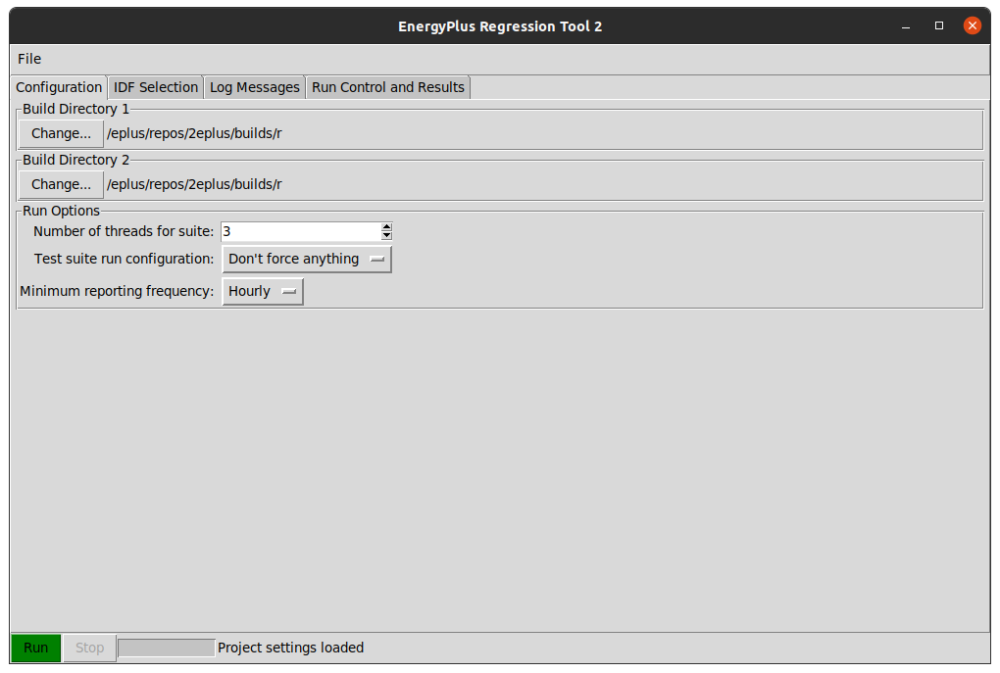

Running from GUI
================

For many developers, a GUI is preferred over command line. To maximize
efficiency, a GUI was developed for this test suite tool that leveraged
the underlying scripts as much as possible. This means very little
duplicated code/effort. Lots of aspects of running the GUI are described
in the sections of this chapter.

Starting the Program
--------------------

Starting the GUI program will depend on how the package is installed/downloaded.

- Downloaded binary from Github release page:
  - In this case, the user will simply run the downloaded binary
- Installed via Pip:
  - In this case, a binary (`energyplus_regression_runner`) will be installed with the package that will allow running the GUI
- Cloned the repo for development:
  - In this case, the user will run the `energyplus_regressions/runner.py` script at the root of the repo

In some cases, a command window is launched prior to showing the graphical interface.
This can be ignored.  When the GUI launches, it should look similar to this figure.

   Screenshot of the GUI immediately after launch

At this point, the program is ready for user interaction to start a run.
While using the program, the user has the ability to load and save
settings files as they desire, using the File menu.

Test Suite Options
------------------

The first tab shows basic test suite options.
The top options are simply allowing the user to select the base and mod build folders.
The GUI will autodetect which build type is being employed as the user can select between a few types:

 - Visual Studio build folder
 - Unix-style Makefile
 - An EnergyPlus install folder

The user can then select a few settings:
 - Number of threads to employ while running simulations
 - Minimum reporting frequency to limit the amount of output data to process to improve diff speed
 - Run configuration to specify how the files should be executed (design days only, annual, no forcing)

Selecting Input Files
---------------------

The input files are selected on the second tab. The user can
select files by double clicking them in the top list, and they can be removed
by double clicking them in the bottom list.  There are also a few selection options
for selecting a random set, selecting/deselecting all, and selecting all but the
known-slowest files.  A recent enhancement now allows the user to select multiple
files before adding or removing them to the active run list.

Running & Canceling Test Suite
------------------------------

Once files have been selected and test suite options set, the user can try to
execute a test suite.  The first step is that the GUI will attempt to validate
the build folder structure, and stop if a missing file or issue is encountered.
Once the suite has started, most configuration options are disabled in the GUI.
During the run, if many threads are run, the
user may experience lag in this program and the system as a whole. The program
should still update with messages from the background processes as simulations
complete. The user may attempt to cancel the suite at any time while it is running.
However, this will only be caught *in between* EnergyPlus runs, not
during a single run. So it may take a few seconds or minutes before the
suite operation actually cancels smoothly. A hard close of the program
should kill all child processes if need be.

Log Message Interpretation
--------------------------

During GUI operation and while a test suite is running, informational
messages are reported to the log messages tab of the GUI. A screenshot
of the log is shown in this figure:

.. figure:: Images/ScreenshotLog.png
   :alt: Screenshot of the log window of the GUI after a suite was completed
   :width: 100.0%

   Screenshot of the log window of the GUI after a suite was completed

These messages include simple things such as how the GUI has been
initialized, or the file list was successfully built. In addition, the
underlying suite engine reports back the status of each simulation being
run once EnergyPlus has completed and during post-processing steps. Once
the test suite is complete, messages are sent to this log as well as to
the GUI itself, so that the GUI can prepare itself for the next run if
needed.

Last Run Summary
----------------

When a test suite is completed, the GUI processes the results into a
useful high-level results structure. This is shown in the following figure:

.. figure:: Images/ScreenshotSummary.png
   :alt: Screenshot of the summary window of the GUI after a suite was completed
   :width: 100.0%

   Screenshot of the summary window of the GUI after a suite was completed

The summary includes root nodes, including the following, that are filled with
results once a suite is complete:

Cases Run
    This lists all cases that were run for the completed suite

Case N Successful Runs
    This lists all input files that ran successfully in case N
    (base/mod)

Case N Unsuccessful Runs
    This lists all input files that failed in case N (base/mod)

Files Compared
    This lists *all* files compared. For a single input file, there
    could be over a dozen files compared: csv, meter, zone sizing,
    system sizing, and tabular output, error file, bnd file and other
    text files.

Big/Small Math/Table Diffs
    Each of these list the files that hit the within tolerance or out of
    range differences during diff processes.

Files with textual diffs
    This lists all the textual diffs that occurred between the base and
    mod runs, including changes to the eplusout.[err, bnd, shd, audit,
    ...] files.

Once the file list is populated, each file line item will have two columns
where the user can double click that cell and it will open the Files/Explorer/Finder
window to the appropriate results folder.  The base folder will have the output diff
files along with the core results.
