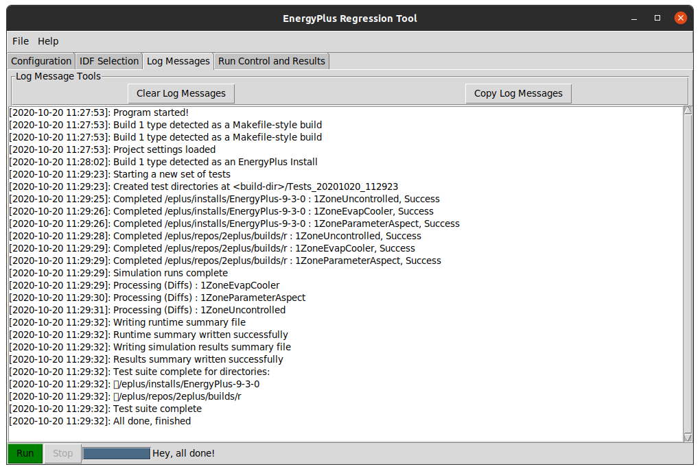
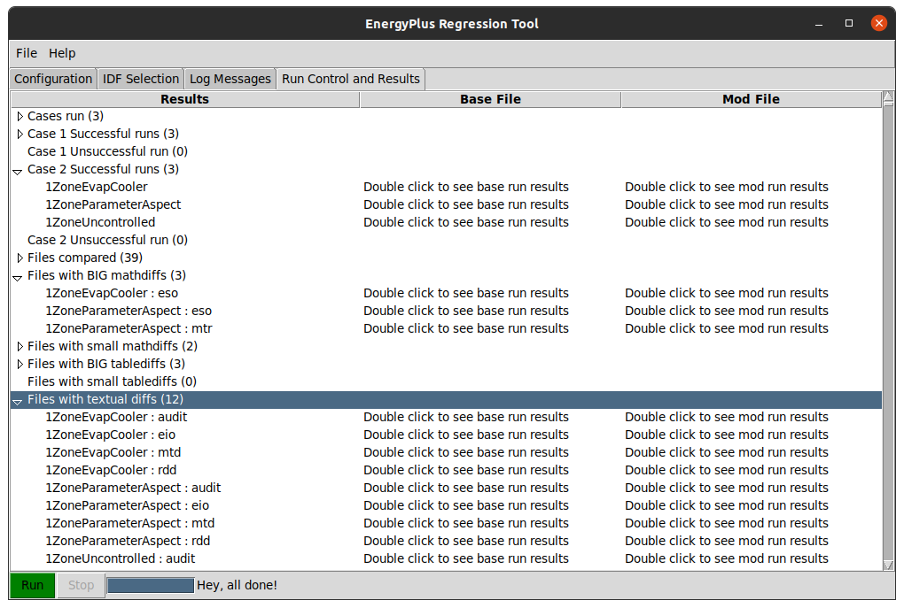

Running from GUI
================

For many developers, a GUI is preferred over command line. To maximize
efficiency, a GUI was developed for this test suite tool that leveraged
the underlying scripts as much as possible. This means very little
duplicated code/effort. Lots of aspects of running the GUI are described
in the sections of this chapter.

Starting the Program
--------------------

The GUI can be started by clicking on the Python script called
``MainWindow.py``. Based on your setup, it may spawn a terminal window
first, then show the GUI itself. When the GUI launches, it should look
like that shown in this figure.

.. figure:: Images/ScreenShotFirstOpen.png
   :alt: Screenshot of the GUI immediately after launch
   :width: 100.0%

   Screenshot of the GUI immediately after launch

At this point, several things have already happened in the program. The
basic launch procedure follows:

* Initialized file list builder arguments for GUI operation
* Initialized test suite engine arguments for GUI operation
* Build the GUI itself
* Load settings from a previously auto-saved settings file if one exists
* Fill the GUI with settings data
* Start a timer to autosave GUI settings every 5 minutes
* Build the file list using the backend build\_files\_to\_run script

While using the program, the user has the ability to load and save
settings files as they desire, using the File menu.

Selecting Input Files
---------------------

The input files are selected from the main screen. Input files selection
options are analogous to those found when using the command line arguments.
The GUI provides buttons to randomly select <n> files, select all, etc.
Another useful way to select files is to use the “Click to enter list” button.
This will spawn a dialog where a user can paste in a simple list of files,
one per line, and the GUI will select only those files for running. This is
useful because once a suite run is complete, the user has the ability to copy
a list of files from the results tab that, for example, showed out of range
differences in the table output. The user can copy this list, rebuild
EnergyPlus, and then select only these specific diff files for running in the
next suite. Another useful way to select files is to verify from a folder.
This is convenient if a selected folder only contains a specific set of input
files to run. By selecting a folder, the GUI will deselect all files first, then
re-add any files that are found in the selected folder.

Test Suite Options
------------------

The options for running the test suite are on the main screen as well.
The options for running the test suite are quite similar to those in the
command line section, however a little simpler. In the command line section,
the user must explicitly specify build folders and the accompanying source folders.
The GUI has the ability to "mine out" the source directory from an existing
build directory.  The check mark on each case says whether those files need
to be re-run or if the outputs are already there.  On Ubuntu, there is a
spinner that allows the user to select the number of threads to use when
running simulations. On Windows, due to a known issue, this is not
exposed, and the test suite will only run a single thread in GUI mode.
There is then an option to select a
minimum reporting frequency. This is most convenient on large-scale
testing with annual simulations, as using daily will force E+ to output
daily variables as the most frequent report, thus reducing the amount of
data to be processed. The last option allows the user to select a run
configuration (design day only, annual, etc.). An informational label is
updated to let the user know where results will be stored.

Verifying File Structure
------------------------

The GUI provides the ability to pre-validate all the files that will be
required in the simulation. By clicking “Validate Test Suite
Structure”, the GUI will use the information in the settings
to validate many file paths. In this validation process, the GUI checks for the base and mod
directories, IDD files, executables, input files, and required tools and files.

Running & Canceling Test Suite
------------------------------

Once files have been selected, test suite options set, and the file
structure validated, the test suite can be started. A button at
the bottom allows the user to run the suite. While the suite is running,
the user can do other things, including save the settings or prepare for
another test suite. The simulations are run on a separate thread, and on
Ubuntu it could be many underlying threads. If many threads are run, the
user may experience lag in this program and the system as a whole. The program
should still update with messages from the background processes as simulations
complete. The user may attempt to cancel the suite at any time while it is running.
However, this will only be caught *in between* EnergyPlus runs, not
during a single run. So it may take a few seconds or minutes before the
suite operation actually cancels smoothly. A hard close of the program
should kill all child processes if need be.

Log Message Interpretation
--------------------------

During GUI operation and while a test suite is running, informational
messages are reported to the log messages tab of the GUI. A screenshot
of the log is shown in this figure:

   Screenshot of the log window of the GUI after a suite was completed

These messages include simple things such as how the GUI has been
initialized, or the file list was successfully built. In addition, the
underlying suite engine reports back the status of each simulation being
run once EnergyPlus has completed and during post-processing steps. Once
the test suite is complete, messages are sent to this log as well as to
the GUI itself, so that the GUI can prepare itself for the next run if
needed.

Last Run Summary & Re-do-ing
----------------------------

When a test suite is completed, the GUI processes the results into a
useful high-level results structure. This is shown in
Figure [fig:screenshotsummary].

   Screenshot of the summary window of the GUI after a suite was completed

The summary includes root nodes, including the following, that are filled with
results once a suite is complete:

Cases Run
    This lists all cases that were run for the completed suite

Case N Successful Runs
    This lists all input files that ran successfully in case N
    (base/mod)

Case N Unsuccessful Runs
    This lists all input files that failed in case N (base/mod)

Files Compared
    This lists *all* files compared. For a single input file, there
    could be over a dozen files compared: csv, meter, zone sizing,
    system sizing, and tabular output, error file, bnd file and other
    text files.

Big/Small Math/Table Diffs
    Each of these list the files that hit the within tolerance or out of
    range differences during diff processes.

Files with textual diffs
    This lists all the textual diffs that occurred between the base and
    mod runs, including changes to the eplusout.[err, bnd, shd, audit,
    ...] files.

*Right clicking is disabled right now*.
This tree provides a nice summary of the suite results, but also
provides a quick way to re-run problem files. By right clicking on any
of the nodes in the summary, an option is provided to “Copy files from
this node to the clipboard”. If this is performed, files from the
currently selected entry (Unsuccessful Runs, for example) will be copied
to the clipboard. Then back on the IDF selection tab, the user can
select “Click to enter list”, and paste it directly in. This is a great
way to re-run problem files after making small fixes.

Another great addition to this summary is the ability to navigate right
to the diff folder. By expanding the tree down to the third level, where
files are listed, you can double click on a filename, and the native
file browser on your system will open to the folder containing the base
run results and diff files for that case. This has not been tested on
Macs yet, but works well on Windows and Ubuntu.